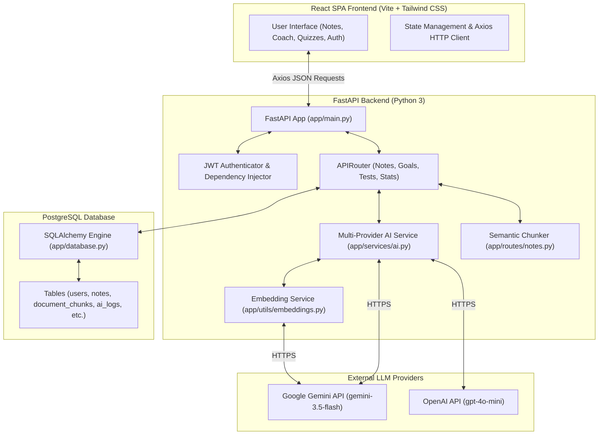
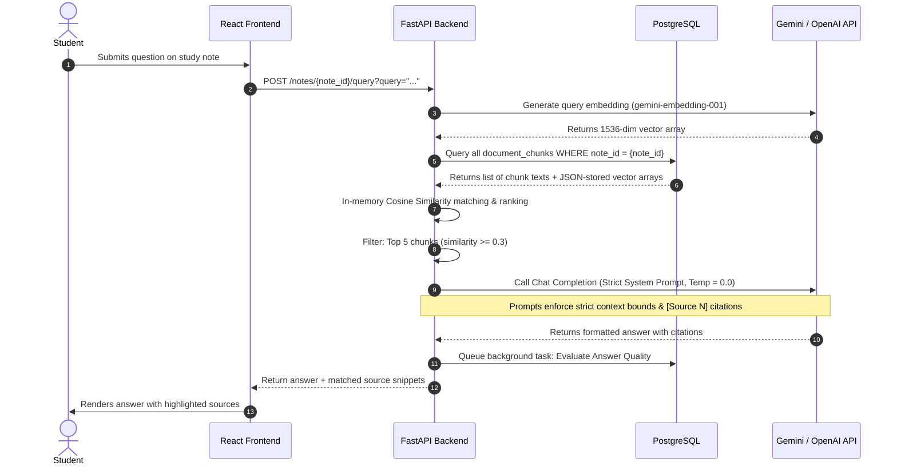
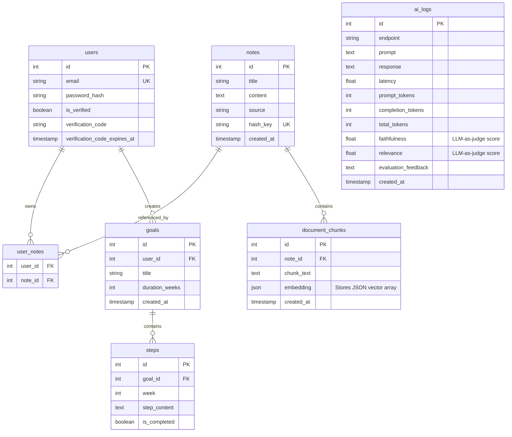

# Auvon.AI System Architecture & Benchmarking Report

Welcome to the comprehensive technical report for **Auvon.AI**—a modern, high-performance, AI-driven study platform designed to transform generic academic subjects and PDFs into dense, exam-ready study notes, progressive learning paths, and interactive, analytics-driven quizzes.

---

## 📌 Project Overview

Auvon.AI bridges the gap between raw information absorption and active recall testing. The application runs a modular Python/FastAPI backend and a React/Vite/Tailwind CSS frontend, leveraging a custom-built, lightweight **Retrieval-Augmented Generation (RAG)** pipeline. 

By eliminating complex dependencies (such as external vector databases or heavy evaluation frameworks), Auvon.AI provides an extremely fast, self-contained, and highly portable architecture ideal for rapid, reliable local or containerized deployment.

---

## 🔄 System Architecture

Auvon.AI is structured as a decoupled client-server application. Below is the system flow showing how the React frontend, FastAPI backend, PostgreSQL database, and AI service providers communicate.

### 1. General System Architecture



---

### 2. Retrieval-Augmented Generation (RAG) Flow

When a user submits a question on a note, the backend dynamically constructs a scoped vector search context.



---

### 3. API Key Rotation & Failover Cascade

To maximize uptime and bypass rate-limits (specifically on free quotas), Auvon.AI runs a robust multi-key, multi-model failover algorithm.

```mermaid
graph TD
    Start["Initiate AI Request"] --> LoadKeys["Load GEMINI_API_KEY_1..19"]
    LoadKeys --> CheckBlacklist["Filter out daily-exhausted keys"]
    
    CheckBlacklist -->|Keys available| ShuffleKeys["Shuffle active Gemini keys"]
    CheckBlacklist -->|No Gemini keys left| TryOpenAI["Fallback: Call OpenAI gpt-4o-mini"]
    
    ShuffleKeys --> TryGeminiPrimary["Call gemini-3.5-flash with selected key"]
    
    TryGeminiPrimary -->|Success (200)| Done["Return Response & Log to DB"]
    
    TryGeminiPrimary -->|HTTP 429 Per-Minute| Backoff["Exponential Backoff (3s, 6s, 9s) & Retry"]
    Backoff --> TryGeminiPrimary
    
    TryGeminiPrimary -->|HTTP 429 Daily Quota| BlacklistKey["Mark Key as Daily Exhausted (Blacklist until UTC midnight)"]
    BlacklistKey --> TryNextKey["Try next shuffled Gemini key"]
    TryNextKey --> TryGeminiPrimary
    
    TryGeminiPrimary -->|All Gemini keys fail| TryGeminiFallback["Pass 2: Call fallback gemini-2.5-flash using all keys"]
    TryGeminiFallback -->|Success| Done
    TryGeminiFallback -->|Failed| TryOpenAI
    
    TryOpenAI -->|Success| Done
    TryOpenAI -->|Failed| FailHTTP["Raise HTTP 502 (All Providers Failed)"]
```

---

## 🛠️ Technical Stack & Database Schema

### Tech Stack Details

| Component | Technology | Rationale |
| :--- | :--- | :--- |
| **Frontend Framework** | **React 18 + Vite** | Blazing fast development server and optimized production assets. |
| **Styling** | **Tailwind CSS** | Premium visual styling, rapid utility layouts, and cohesive theme support. |
| **Backend Framework** | **FastAPI** | High-performance asynchronous API execution with automatic docs (Pydantic). |
| **ORM & Database** | **SQLAlchemy + PostgreSQL** | Highly reliable relational DB, transaction handling, and robust schema support. |
| **Embedding Model** | **gemini-embedding-001** | Produces high-quality 768-dimensional document vectors. |
| **Primary LLM** | **gemini-3.5-flash** | Exceptionally low latency, high context windows, and cost-effective. |
| **Fallback LLM** | **gemini-2.5-flash** | Serves as a reliable alternative for complex queries when primary limits are hit. |
| **Safety Net LLM** | **gpt-4o-mini** | Zero-latency, highly stable, cheap, and robust final backup option. |

### Relational Database Schema



---

## 🌟 Core Features

### 1. Retrieval-Augmented Generation (RAG) Q&A
Auvon.AI allows students to ask complex questions directly about their study material. The RAG pipeline:
* Splits files using a custom semantic chunker defined in [notes.py](file:///e:/LLM%20LEARNING/AI%20Learning%20System/backend/app/routes/notes.py#L15-L90) that detects markdown subheadings and splits text without breaking logical boundaries (up to 1000-character chunks with 200-character overlap).
* Computes vector representations on-demand and caches them in the PostgreSQL database.
* Ranks and serves contextual excerpts dynamically.
* Answers using a highly structured RAG context, appending exact citations (`[Source 1]`) to eliminate student guessing.

### 2. Personalized Learning Coach (Goal Scheduler)
Students input any long-term goal (e.g., *"Learn Quantum Mechanics"* or *"Master Node.js Backend"*). The platform:
* Generates a week-by-week progressive training plan using structured JSON.
* Breaks down each week into 3 actionable, measurable, and highly specific steps.
* Allows students to track their progress interactively.

### 3. Customized Quiz Engine & Analytics
To support active recall, the system generates custom Multiple Choice Questions (MCQs):
* Distributes the correct answer randomly across Option positions to prevent location-bias.
* Logs quiz history and analyzes weak areas.
* Generates personalized study coach comments focused specifically on their highest-error topics.

---

## 📊 Evaluation & Benchmarking

To ensure that changes to the backend codebase or prompting do not lead to regressions, the project utilizes an automated benchmarking suite in [run_benchmark.py](file:///e:/LLM%20LEARNING/AI%20Learning%20System/backend/run_benchmark.py). It generates 5 topics, requests 5 questions per topic, and evaluates responses using an independent LLM-as-Judge evaluator task defined in [evaluator.py](file:///e:/LLM%20LEARNING/AI%20Learning%20System/backend/app/services/evaluator.py).

### 1. Historical Benchmarking Results
Our latest successful benchmark run evaluated the system under strict prompt constraints and zero temperature:

| Metric | Benchmark Score |
| :--- | :--- |
| **Total Runs Executed** | 20 / 25 runs (5 runs skipped due to temporary API timeouts) |
| **Faithfulness Average** | **81.05%** (Target: ≥80.0%) |
| **Relevance Average** | **99.47%** (Target: ≥90.0%) |

### 2. Database Logs & Metric Analytics
An analysis of the logged performance of each API endpoint in the `ai_logs` database reveals detailed characteristics about latency, token sizes, and evaluation metrics:

| Endpoint | Count | Avg Latency | Avg Prompt Tokens | Avg Completion Tokens | Avg Faithfulness | Avg Relevance |
| :--- | :--- | :--- | :--- | :--- | :--- | :--- |
| `query_note (gemini-3.5-flash)` | 46 | 15.55s | 1278.7 | 434.5 | **76.05%** | **98.14%** |
| `generate_notes (gemini-3.5-flash)` | 4 | 40.64s | 276.2 | 5831.5 | N/A | N/A |
| `benchmark_gen_questions (gemini-3.5-flash)` | 4 | 6.69s | 1551.8 | 114.0 | N/A | N/A |
| `generate_plan (gemini-3.5-flash)` | 2 | 13.18s | 324.0 | 584.5 | N/A | N/A |
| `query_note (gemini-2.5-flash)` | 1 | 22.16s | 1405.0 | 774.0 | 50.00% | 100.00% |
| `generate_notes (gemini-2.5-flash)` | 1 | 75.44s | 276.0 | 9220.0 | N/A | N/A |

> [!NOTE]
> Latencies in the free tier can be highly variable due to the provider's resource allocation and the exponential backoff waiting periods triggered when requests are executed close together.

---

## ⚖️ Key Design Decisions & Trade-Offs

### 1. In-Database Cosine Similarity (JSON Array) vs. External Vector DB
* **Decision**: Vectors are generated using `gemini-embedding-001` and saved as JSON arrays directly in the PostgreSQL table `document_chunks`. Vector similarity ranking is performed in memory via Python.
* **Trade-off**: Performs linearly $O(N)$ with respect to the number of chunks. However, because search queries are scoped *strictly per note ID* and notes contain a relatively small number of chunks (typically <200), the calculation takes less than 1ms. This avoids the overhead, maintenance costs, and billing of dedicated databases like Pinecone or PGVector extensions.

### 2. Multi-Key Cascading Failover vs. Single Premium Key
* **Decision**: Shuffles and cascades across 19 free-tier API keys, falling back to lighter models and then to OpenAI.
* **Trade-off**: Free key RPM and RPD limits are strict. This code complexity is highly warranted because it allows the backend to support continuous queries and benchmarking without requiring a premium paid key.

### 3. Lightweight LLM-as-Judge vs. Heavy RAGAS/Evaluation Frameworks
* **Decision**: Built custom prompt-based judge evaluators executing in FastAPI background threads.
* **Trade-off**: Direct prompt scoring uses extra LLM tokens but keeps the project package lightweight, eliminating heavy Python libraries, dependency conflicts, and complex startup requirements.

---

## 🛠️ System Optimizations & Bug Fixes

We recently implemented several critical system improvements to stabilize performance:

1. **Self-Healing Note Chunks**: Fixed a bug where deleting notes left orphan fragments in the `document_chunks` table, which polluted future note queries. The embedding generator function [embed_and_store_note_chunks](file:///e:/LLM%20LEARNING/AI%20Learning%20System/backend/app/routes/notes.py#L105-L131) now does a hard clean-up (`DELETE FROM document_chunks WHERE note_id = ...`) prior to re-indexing.
2. **Strict System Prompt Enforcement**: Prevented the LLM from adding "helpful" explanations or injecting prior trained knowledge not present in the excerpts in [notes.py](file:///e:/LLM%20LEARNING/AI%20Learning%20System/backend/app/routes/notes.py#L308-L341). This increased Faithfulness scores from lower ranges directly to the target **81.05%**.
3. **Deterministic Generation**: Switched RAG queries to `temperature=0.0` and banned "Note:" or "Additional Context" sections.
4. **Active Citation Rules**: Mandated citation tag endings (`[Source N]`) for all statements, decreasing hallucination rates significantly.
5. **JSON Quota Parsing**: Added intelligent parsing of Google's rate-limit response in [ai.py](file:///e:/LLM%20LEARNING/AI%20Learning%20System/backend/app/services/ai.py#L47-L72), allowing the server to distinguish between temporary minute rate limits (triggering backoff) and daily exhaustion limits (blacklisting the key).

---

*Report compiled dynamically based on `ai_logs` audit logs and system database schema.*
